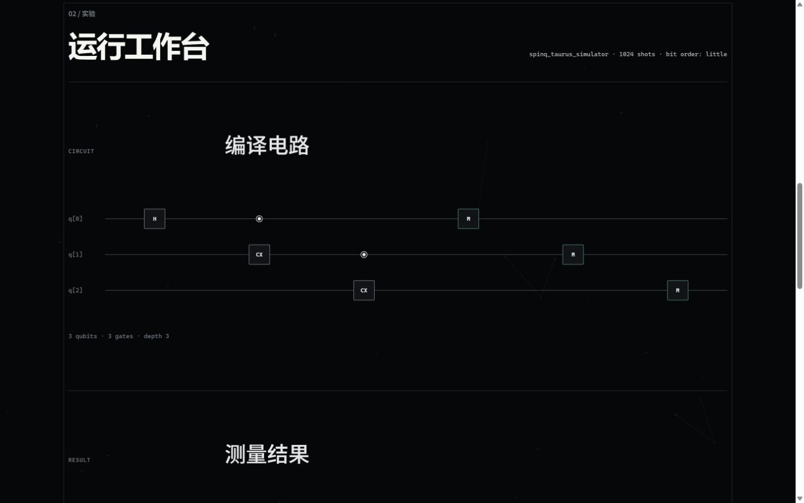
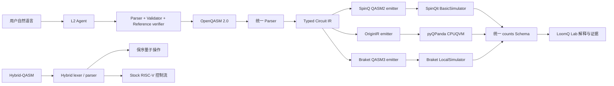

# LoomQ Lab

> LoomQ 从一个问题开始，把它变成一份可以运行、验证和解释的量子实验。

> **One language → many quantum machines：** 一份 OpenQASM，经一次 typed-IR 验证，可落到 SpinQ、OriginQ 与 Braket；证据与评分说明在这一主叙事之后。

> **评委 60 秒入口：** [JUDGE_GUIDE.md](JUDGE_GUIDE.md) · [评分自审](evidence/SCORECARD.md) · [最终人类清单](FINAL_HUMAN_CHECKLIST.md)

LoomQ Lab 是 LoomQ 2026 的 L1 + L2 + L3 参赛实现：L1 用统一编译层连接 SpinQ、OriginQ 与 Braket 三个后端；L2 把自然语言意图转为经过程序自验的电路；L3 将 Hybrid-QASM 的经典控制块编译为官方 stock RISC-V 子集。它面向从未接触量子计算的人文社科学生、设计师、产品经理、艺术创作者和普通 AI 用户。

用户不必先读懂 QASM：先从一个问题和可运行实验出发，Agent 生成或修复程序，统一编译层产生 SpinQ QASM2、OriginIR 与 Braket QASM3，真实本地 SDK 返回采样结果，界面再解释“结果证明了什么，以及没有证明什么”。Hybrid-QASM 使用独立 lexer/parser，保留可审计的程序结构。



## 当前交付

- **L1 三后端**：SpinQit BasicSimulator、pyQPanda CPUQVM、AWS Braket LocalSimulator。
- **统一编译层**：一个 OpenQASM 2.0 parser、一套冻结 IR、三个目标 emitter；没有三套重复 parser。
- **完整 12 门**：`h x s sdg t tdg rz ry cx cu1 swap ccx`，包括参数表达式、多个寄存器、逐位测量和 little-endian counts。
- **L2 三任务**：自然语言生成、保持意图的 QASM 修复、按官方 JSON 能力表推荐后端。
- **Agent 自验**：严格 JSON 工具协议 → parser → validator → 独立参考模拟器；失败最多修复一次。
- **L3 混合编译**：真正解析多 classical block、嵌套分支、测量位与顺序赋值，输出保序量子操作和 stock RISC-V。
- **Custom Quantum RISC-V**：稳定 `custom-0` 32-bit 编码与确定性 coprocessor trace；不冒充量子模拟或硬件。
- **两平台真机证据**：SpinQ 2 比特核磁硬件与 Origin Wukong 180-2 的可追溯任务、原始导出和隐私安全截图。
- **一页式入口**：桌面与移动 Web、可访问电路图、真实证据链、counts 图表/表格、默认展开的浅色 QASM 与错误恢复。

本版本申报 L1、L2、L3、两平台真机（SpinQ + OriginQ）、自定义量子 RISC-V Bonus 与新手引导 Bonus。内部参考模拟器只用于验证，`adapter.run()` 的三个 target 都调用真实第三方 SDK；真机证据见 [evidence/README.md](evidence/README.md)，其可追溯性由组委会登录平台复核。

## 5 分钟跑完第一次实验

完成环境启动后，点击“重做刚才的 Bell 实验”，再点击“执行这个实验”：你会看到真实本地 SDK 返回的 Bell `00/11` counts、验证、解释、电路与默认展开的 OpenQASM。页面同时标明计算基结果、完整纠缠判断和真实硬件结论各自需要的证据。此路径无需模型 Key。

### Windows PowerShell

仓库根目录执行：

```powershell
.\starter_kit\scripts\setup.ps1
.\.venv\Scripts\python.exe -m starter_kit.loomq.web.server
```

打开 `http://127.0.0.1:8765/`，点击“重做刚才的 Bell 实验”载入 Bell 示例，再点击“执行这个实验”。这个本地入口无需模型 Key，但仍真实运行所选量子 SDK；自由输入和 GHZ 等 Agent 任务需要配置 `LOOMQ_LLM_*`。

V7.1 人类审核使用的 Windows 启动命令（从当前 worktree）：

```powershell
$Repo = (Get-Location).Path
$Py = Join-Path $Repo '.venv\Scripts\python.exe'
Set-Location $Repo
& $Py -X utf8 -m starter_kit.loomq.web.server --host 127.0.0.1 --port 8765
```

不要双击 `starter_kit/loomq/web/static/index.html`：`file://` 只能显示静态界面，无法连接 Python SDK 后端。若误开，页面会给出本地服务启动地址，不会误报成 LLM 配置错误。

### Linux / macOS

需要可用的 `python3.10`：

```bash
sh starter_kit/scripts/setup.sh
.venv/bin/python -m starter_kit.loomq.web.server
```

如果当前工作目录已经是 `starter_kit/`，Web 命令改为：

```bash
python -m loomq.web.server
```

Python 3.10 是正式基础镜像版本。`spinqit==0.2.4` 只提供 cp310 wheel；依赖锁还将 Braket 固定在与 SpinQit ANTLR 4.9.2 共存的最后兼容线。

### 可选依赖：Origin Wukong 现代 Runtime 路径

核心评测（L1/L2/L3、SpinQ、Braket、RISC-V）**不需要** `qpanda3-runtime` / `pyqpanda3`。这两个包被隔离在 `requirements-originq-runtime.txt` 中，**仅**在复现现代 Origin Wukong 180-2 Runtime 证据（`starter_kit/hardware/originq_runtime_real.py`，device `WK_C180_2`）时才需要安装：

```bash
pip install -r starter_kit/requirements-originq-runtime.txt
```

只安装 `requirements.txt` 即可得到一个干净的核心环境，能运行全部 L1/L2/L3、SpinQ、Braket 与 RISC-V 测试。接受的 canonical `originq_real.py`（pyqpanda QCloud, chip 72）保持原样未动。

## 配置真实 L2 模型

自由输入、修复与后端推荐必须走组委会规定的 OpenAI-compatible 环境变量。不要把 Key 写进文件或命令历史共享给他人。

PowerShell：

```powershell
$env:LOOMQ_LLM_BASE_URL = "https://your-openai-compatible-endpoint/v1"
$env:LOOMQ_LLM_API_KEY = "your-private-key"
$env:LOOMQ_LLM_MODEL = "your-model"
$env:LOOMQ_LLM_TIMEOUT_SECONDS = "120"
```

Shell：

```bash
export LOOMQ_LLM_BASE_URL="https://your-openai-compatible-endpoint/v1"
export LOOMQ_LLM_API_KEY="your-private-key"
export LOOMQ_LLM_MODEL="your-model"
export LOOMQ_LLM_TIMEOUT_SECONDS="120"
```

正式评测会注入 `deepseek-v4-flash`。LoomQ 不硬编码 URL、Key 或模型名；缺少配置时 Web 会给出恢复说明，本地示例仍可使用。

## 一条命令验证

Windows：

```powershell
.\starter_kit\scripts\verify.ps1
```

Linux / macOS：

```bash
sh starter_kit/scripts/verify.sh
```

验证脚本执行：

1. `pip check`；
2. 组委会仓库测试；
3. 提交自带的 parser、12 门、三 SDK、隐藏形态、L2、HTTP 与静态 UI 测试；
4. 未修改的官方 L1 evaluator，目标为 `spinq,originq,braket`；
5. 未修改的官方 L2 evaluator，通过一个真实本地 HTTP 模型端点，并确认模型调用次数；
6. diff 与归档体积检查。

单独运行官方公开评测：

```powershell
.\.venv\Scripts\python.exe starter_kit\evaluator.py --level l1 --target spinq,originq,braket --json-out starter_kit\evidence\files\l1-public-report.json
.\.venv\Scripts\python.exe starter_kit\tests\public_l2_fake.py
```

`public_l2_fake.py` 只验证协议、真实 HTTP 调用与官方提取器，不声称替代正式 DeepSeek 语义评测。

## 架构



核心目录：

```text
loomq/
├── compiler/     # 安全参数表达式、parser、validator、IR、metrics
├── emitters/     # 三种目标原生文本
├── runners/      # 三个真实 SDK 与统一结果
├── simulator.py  # 独立验证 oracle，不作为 target fallback
├── agent/        # 模型协议、能力筛选、自验与一次修复
├── hybrid/       # Hybrid-QASM scanner、AST、parser 与 stock RISC-V compiler
└── web/          # 标准库 HTTP 服务与离线静态单页
```

完整边界、位序与平台差异见 [ARCHITECTURE.md](ARCHITECTURE.md)。零基础操作见 [USER_GUIDE.md](USER_GUIDE.md)。用没有量子背景的话讲清整个实现见 [IMPLEMENTATION_EXPLAINER.md](IMPLEMENTATION_EXPLAINER.md)。

## 固定 Adapter 契约

正式入口仍是 `adapter.py`：

```python
def transpile(qasm_str: str, target: str) -> str: ...
def run(qasm_str: str, target: str, shots: int) -> dict: ...
def agent_chat(prompt: str) -> str: ...
def compile_hybrid(hybrid_qasm_str: str) -> tuple[list, str]: ...
```

`compile_hybrid` 已实现真正的 L3 lexer/parser/compiler，并在 `submission.yaml` 中声明 L3。`run()` 返回：

```json
{
  "backend": "braket_local_simulator",
  "job_id": "local-task-id",
  "shots": 1024,
  "counts": {"000": 508, "111": 516},
  "bit_order": "little",
  "timestamp": "2026-08-18T09:00:00Z",
  "meta": {"engine": "braket_local_simulator", "transpiled_gates": 3, "depth": 3}
}
```

最右侧字符始终是 `c[0]`。平台若按测量顺序返回 key，runner 会用 IR 中的 `qubit → cbit` 映射重建结果；它不会用理想分布替换实际 counts。

## Docker 基线

在 `starter_kit/` 内：

```bash
docker build -t loomq-submission .
docker run --rm loomq-submission
```

默认容器命令只跑无需网络的 L1 三后端。L2 正式评测由组委会注入模型环境；本机没有 Docker 时，不能把 Python venv 验证写成“Docker 已通过”。

## 评分证据与边界

人工评分入口为 [evidence/README.md](evidence/README.md)。截图是流程说明，不替代可运行代码、原始结果或真机 job ID。

- 已申报：L1/L2/L3、L1 两平台真机（SpinQ + OriginQ）、L2 交互体验、工程与产品化、自定义量子 RISC-V、新手引导与视觉叙事。
- 真机证据：`evidence/README.md` 与 `evidence/files/` 中的原始导出、任务截图与哈希；组织方仍可登录平台复核 job ID 的真实性。
- 参考模拟器最多 16 qubits，用于快速 Agent 自验；三方 SDK 按官方能力表运行更大电路。
- 当前自动验证使用本地兼容模型端点；只有在提供个人 `LOOMQ_LLM_*` 后才能做真实公网模型 smoke，正式分以组委会环境为准。

## 最终提交

在最终 clean、已推送的 commit 上运行：

```bash
python3 starter_kit/prepare_submission.py --team-id WayneYu1212
```

随后用输出的公开 fork URL 与 40 位 SHA 创建上游“LoomQ 最终提交”Issue。只有 `submission:accepted` 标签和归档 SHA-256 回执才构成有效提交；截止为 **2026-08-25 12:00 UTC+8**。

## V7 MAX Web 交付边界

当前 Web 入口把“看见结果 → 拆解 H/CNOT → 预测 Bell → 运行本地 Bell → 查看 X/Y/Z → 读 tomography”组织成一条新手路径。生产可编辑范围只包括 `starter_kit/loomq/web/static/index.html`、`styles.css`、`app.js` 以及本次同步的说明文档；后端、evaluator、requirements、submission.yaml、raw/hardware evidence 保持冻结。

评委在页面的“评委证据路线”可先看计分真机 SpinQ + OriginQ，再看 Wukong X/Y/Z 与 tomography 补充科学，最后查看 Agent 三任务、统一 typed IR、L3 Hybrid-QASM 与 Custom RISC-V 的工程验证路径。该入口只导航现有材料，不生成新的 job 或硬件声明。

页面会把 `00/11` 明确写成计算基相关性，把 X/Y/Z 三个归档方向写成完整状态描述所需的更多信息，并把 Fidelity `0.952449` / PPT `-0.4561` 限定为 provider 重建点估计。归档哈希的既有 provenance discrepancy 如实保留：metadata 记录 `a56b4e20039f…`，当前 raw JSON、density audit 与 `SHA256SUMS.txt` 记录 `9f7b903131aa…`；本轮没有改写任何 raw bytes 或科学数值。
