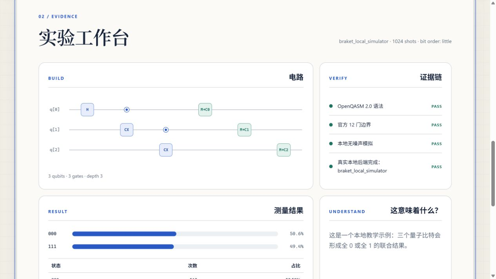
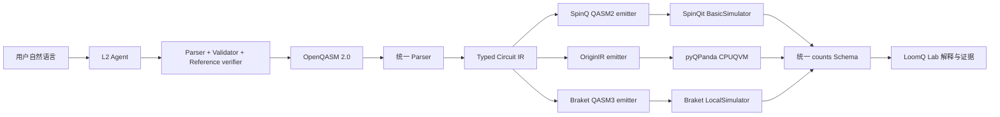

# LoomQ Lab

> 用一句人话创建量子程序；用一套统一 IR 发往三个平台；在展示结果之前，先用程序验证它。

LoomQ Lab 是 LoomQ 2026 的 L1 + L2 参赛实现，面向从未接触量子计算的人文社科学生、设计师、产品经理、艺术创作者和普通 AI 用户。它不要求用户先读懂 QASM：用户描述意图，Agent 生成或修复程序，统一编译层产生 SpinQ QASM2、OriginIR 与 Braket QASM3，真实本地 SDK 返回采样结果，界面再解释“结果证明了什么，以及没有证明什么”。



## 当前交付

- **L1 三后端**：SpinQit BasicSimulator、pyQPanda CPUQVM、AWS Braket LocalSimulator。
- **统一编译层**：一个 OpenQASM 2.0 parser、一套冻结 IR、三个目标 emitter；没有三套重复 parser。
- **完整 12 门**：`h x s sdg t tdg rz ry cx cu1 swap ccx`，包括参数表达式、多个寄存器、逐位测量和 little-endian counts。
- **L2 三任务**：自然语言生成、保持意图的 QASM 修复、按官方 JSON 能力表推荐后端。
- **Agent 自验**：严格 JSON 工具协议 → parser → validator → 独立参考模拟器；失败最多修复一次。
- **一页式入口**：桌面与移动 Web、可访问电路图、真实证据链、counts 图表/表格、QASM 折叠与错误恢复。

第一版明确不参加 L3，也没有申报真机分。内部参考模拟器只用于验证，`adapter.run()` 的三个 target 都调用真实第三方 SDK。

## 5 分钟启动

### Windows PowerShell

仓库根目录执行：

```powershell
.\starter_kit\scripts\setup.ps1
.\.venv\Scripts\python.exe -m starter_kit.loomq.web.server
```

打开 `http://127.0.0.1:8765/`，点击“让两枚量子硬币保持一致”或“制造三个彼此关联的量子比特”。这两个本地示例无需模型 Key，但仍真实运行量子 SDK。

### Linux / macOS

需要可用的 `python3.10`：

```bash
sh starter_kit/scripts/setup.sh
.venv/bin/python -m starter_kit.loomq.web.server
```

如果当前工作目录已经是 `starter_kit/`，Web 命令改为：

```bash
python -m loomq.web.server
```

Python 3.10 是正式基础镜像版本。`spinqit==0.2.4` 只提供 cp310 wheel；依赖锁还将 Braket 固定在与 SpinQit ANTLR 4.9.2 共存的最后兼容线。

## 配置真实 L2 模型

自由输入、修复与后端推荐必须走组委会规定的 OpenAI-compatible 环境变量。不要把 Key 写进文件或命令历史共享给他人。

PowerShell：

```powershell
$env:LOOMQ_LLM_BASE_URL = "https://your-openai-compatible-endpoint/v1"
$env:LOOMQ_LLM_API_KEY = "your-private-key"
$env:LOOMQ_LLM_MODEL = "your-model"
$env:LOOMQ_LLM_TIMEOUT_SECONDS = "120"
```

Shell：

```bash
export LOOMQ_LLM_BASE_URL="https://your-openai-compatible-endpoint/v1"
export LOOMQ_LLM_API_KEY="your-private-key"
export LOOMQ_LLM_MODEL="your-model"
export LOOMQ_LLM_TIMEOUT_SECONDS="120"
```

正式评测会注入 `deepseek-v4-flash`。LoomQ 不硬编码 URL、Key 或模型名；缺少配置时 Web 会给出恢复说明，本地示例仍可使用。

## 一条命令验证

Windows：

```powershell
.\starter_kit\scripts\verify.ps1
```

Linux / macOS：

```bash
sh starter_kit/scripts/verify.sh
```

验证脚本执行：

1. `pip check`；
2. 组委会仓库测试；
3. 提交自带的 parser、12 门、三 SDK、隐藏形态、L2、HTTP 与静态 UI 测试；
4. 未修改的官方 L1 evaluator，目标为 `spinq,originq,braket`；
5. 未修改的官方 L2 evaluator，通过一个真实本地 HTTP 模型端点，并确认模型调用次数；
6. diff 与归档体积检查。

单独运行官方公开评测：

```powershell
.\.venv\Scripts\python.exe starter_kit\evaluator.py --level l1 --target spinq,originq,braket --json-out starter_kit\evidence\files\l1-public-report.json
.\.venv\Scripts\python.exe starter_kit\tests\public_l2_fake.py
```

`public_l2_fake.py` 只验证协议、真实 HTTP 调用与官方提取器，不声称替代正式 DeepSeek 语义评测。

## 架构



核心目录：

```text
loomq/
├── compiler/     # 安全参数表达式、parser、validator、IR、metrics
├── emitters/     # 三种目标原生文本
├── runners/      # 三个真实 SDK 与统一结果
├── simulator.py  # 独立验证 oracle，不作为 target fallback
├── agent/        # 模型协议、能力筛选、自验与一次修复
└── web/          # 标准库 HTTP 服务与离线静态单页
```

完整边界、位序与平台差异见 [ARCHITECTURE.md](ARCHITECTURE.md)。零基础操作见 [USER_GUIDE.md](USER_GUIDE.md)。

## 固定 Adapter 契约

正式入口仍是 `adapter.py`：

```python
def transpile(qasm_str: str, target: str) -> str: ...
def run(qasm_str: str, target: str, shots: int) -> dict: ...
def agent_chat(prompt: str) -> str: ...
```

`compile_hybrid` 保持 `NotImplementedError`，并在 `submission.yaml` 中声明 L3 为 false。`run()` 返回：

```json
{
  "backend": "braket_local_simulator",
  "job_id": "local-task-id",
  "shots": 1024,
  "counts": {"000": 508, "111": 516},
  "bit_order": "little",
  "timestamp": "2026-08-18T09:00:00Z",
  "meta": {"engine": "braket_local_simulator", "transpiled_gates": 3, "depth": 3}
}
```

最右侧字符始终是 `c[0]`。平台若按测量顺序返回 key，runner 会用 IR 中的 `qubit → cbit` 映射重建结果；它不会用理想分布替换实际 counts。

## Docker 基线

在 `starter_kit/` 内：

```bash
docker build -t loomq-submission .
docker run --rm loomq-submission
```

默认容器命令只跑无需网络的 L1 三后端。L2 正式评测由组委会注入模型环境；本机没有 Docker 时，不能把 Python venv 验证写成“Docker 已通过”。

## 评分证据与边界

人工评分入口为 [evidence/README.md](evidence/README.md)。截图是流程说明，不替代可运行代码、原始结果或真机 job ID。

- 已申报：L2 交互体验、工程与产品化、新手引导与视觉叙事。
- 未申报：真机、L3、自定义量子 RISC-V。
- 参考模拟器最多 16 qubits，用于快速 Agent 自验；三方 SDK 按官方能力表运行更大电路。
- 当前自动验证使用本地兼容模型端点；只有在提供个人 `LOOMQ_LLM_*` 后才能做真实公网模型 smoke，正式分以组委会环境为准。

## 最终提交（尚未替用户执行）

提交前需要显式授权 commit/push。授权后再运行：

```bash
python3 starter_kit/prepare_submission.py --team-id WayneYu1212
```

随后用输出的公开 fork URL 与 40 位 SHA 创建上游“LoomQ 最终提交”Issue。只有 `submission:accepted` 标签和归档 SHA-256 回执才构成有效提交；截止为 **2026-08-25 12:00 UTC+8**。
